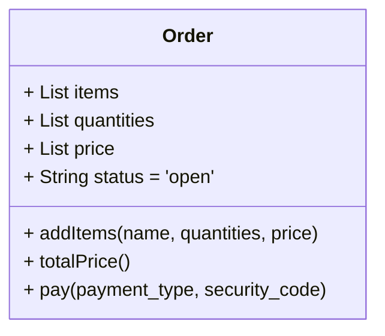

# ✅ SRP(Single Responsibility Principle) : 단일 책임 원칙

> `함수`는 반드시 하나의, 단 하나의 일만 해야 한다는 원칙, 덩치가 큰 함수를 작은 함수로 리팩터링하는 저수준에서 사용된다.

- 클래스는 하나의 책임만 가진다.
- 클래스가 제공하는 `모든 서비스(method)는 하나의 책임을 수행하는데 집중`되어야 한다.
- 환경이 바뀌어서 클래스를 변경해야하는 이유는 오직 하나여야 한다. (책에선 "하나의 모듈(소스 파일)은 하나의, 하나의 액터에 대해서만 책임져야한다."라고 설명한다.)
- 환경 변화로 하나의 클래스가 여러 책임을 갖는 경우 -> 클래스를 분리해야 한다.

## 장점

- 클래스 책임 영역 확실 -> 하나의 책임 변경에 따른 연쇄 변경에서 자유롭다.
- 응집도(cohesion) 강화, 결합도(coupling) 약화, 가독성 향상, 유지보수 용이
 - 여기서 응집성이 단일 액처를 책임지를 코드를 함께 묶어주는 것

## 준수 전략

- 중복된 책임은 추상 클래스로 구현
- 기존의 클래스로 해결할 수 없다면 새로운 클래스 구현

### 주문(Order) 클래스

> 기존에 `pay`라는 결제 기능이 없었는데 요구 사항 추가로 인해 생기게되었다.



환경 변화로인해 하나의 클래스에 `주문`과 `결제`에 대한 기능이 추가 되어 2개의 책임으로 늘어나 단일 책임을 위배한다.

- 해결방법 `pay`기능만 책임지는 `PaymentProcessor` 클래스를 추가

  ```mermaid
  classDiagram

  class Order{
          + List items
          + List quantities
          + List price
          + String status = 'open'

          + addItems(name, quantities, price)
          + totalPrice()
      }

      class PaymentProcessor{
          + payDebit()
          + payCredit()
      }
  ```

<br />

# 실습

## SRP에 위배된 코드

```js
class Order {
  constructor() {
    this.items = [];
    this.quantities = [];
    this.prices = [];
    this.status = "open";
  }

  addItem(name, quantity, price) {
    this.items.push(name);
    this.quantities.push(quantity);
    this.prices.push(price);
  }

  totalPrice() {
    let total = 0;
    for (let i = 0; i < this.prices.length; i++) {
      total += this.quantities[i] * this.prices[i];
    }
    return total;
  }

  // 🚨 Order와 관련 없는 책임
  pay(payment_type, security_code) {
    if (payment_type === "debit") {
      console.log("직불카드 결재를 시작합니다.");
      console.log(`비밀번호 확인: ${security_code}`);
      console.log("결재가 완료되었습니다.");
      this.status = "paid";
    } else if (payment_type === "credit") {
      console.log("신용카드 결재를 시작합니다.");
      console.log(`비밀번호 확인: ${security_code}`);
      console.log("결재가 완료되었습니다.");
      this.status = "paid";
    } else {
      throw Error(`적용할 수 없는 결재 방법입니다: ${payment_type}`);
    }
  }
}

const order = new Order();
order.addItem("Keyboard", 1, 50);
order.addItem("SSD", 1, 150);
order.addItem("USB cable", 2, 5);

console.log(`결재 금액은 ${order.totalPrice()} 입니다.`);
// 🚨 order에 종속된 pay 기능
order.pay("debit", "0372846");
```

## 책임 분리

```js
class Order {
  constructor() {
    this.items = [];
    this.quantities = [];
    this.prices = [];
    this.status = "open";
  }

  addItem(name, quantity, price) {
    this.items.push(name);
    this.quantities.push(quantity);
    this.prices.push(price);
  }

  totalPrice() {
    let total = 0;
    for (let i = 0; i < this.prices.length; i++) {
      total += this.quantities[i] * this.prices[i];
    }
    return total;
  }
}

// 💡 Odder 클래스에서 책임(pay)을 분리하기 위해
class PaymentProcessor {
  payDebit(order, security_code) {
    console.log("직불카드 결재를 시작합니다.");
    console.log(`비밀번호 확인: ${security_code}`);
    console.log("결재가 완료되었습니다.");
    order.status = "paid";
  }
  payCredit(order, security_code) {
    console.log("신용카드 결재를 시작합니다.");
    console.log(`비밀번호 확인: ${security_code}`);
    console.log("결재가 완료되었습니다.");
    order.status = "paid";
  }
}

const order = new Order();
order.addItem("Keyboard", 1, 50);
order.addItem("SSD", 1, 150);
order.addItem("USB cable", 2, 5);

console.log(`결재 금액은 ${order.totalPrice()} 입니다.`);

// 💡 PaymentProcess 객체 생성 및 실행
const processor = new PaymentProcessor();
processor.payDebit(order, "0372846");
```

---

# ✅ ISP(Interface Segregation Principle): 인터페이스 분리의 원칙

- 클래스는 `자신이 사용하지 않은 인터페이스는 구현하지 말아야 한다.`
- 어떤 클래스가 다른 클래스에 종속될 경우에는 최소한의 인터페이스만 사용한다.
- 인터페이스를 다수의 작은 단위로 구분하고, 사용자는 자신이 필요한 인터페이스만 사용하도록 구현한다.

## ISP와 프로그래밍 언어와의 관계
- 동적 타입 언어(자바스크립트, 루비, 파이썬)과 같은 언어에서는 코드의 의존성이 없는 경우가 있지만 대신에 런타임 추론이 발생한다.
> 예를 들면 자바스크립트에선 SPA 구조에서 `document` 객체를 따로 선언하지 않아도 사용이 가능한다. 브라우저 런타임시 이미 document 객체를 내포하고 있기 때문이고, 웹 스펙에서 document 객체의 사용방법이 변경되었다하더라도 컴파일 단계에서는 고려하지않아 재컴파일과 재배포가 필요하지 않다. 
> 
> 하지만 정적 타입 언어(C/C++)은 `include`, `using namespace`, `import`와 같은 작성하는 소스 파일 내에 타입과 기능을 주입해주지 않으면, 컴파일 레벨에서 판단이 불가능하여 코드 의존성이 발생한다. 그때문에 재컴파일과 재배포가 필요해진다.

- 컴파일 타임에는 호환되는 시그니처의 메서드가 타입 계층 구조 어딘가에 존재하는지까지만 확인할 뿐. ISP는 `언어 종류`마다 영향도가 다르다. 

# 실습

> 기존에 `결제` 시스템에서 보안 강화를 위한 `SMS` 인증 기능을 추가해야하는 환경으로 변경

- 직불(Debit) 카드, 신용(Credit) 카드 기능을 통해 결재 가능
- 직불/페이팔은 SMS 인증이 필요
- 신용 카드는 `security_code`만 활용하는 상황을 가정

## 결제(PaymentProcessor) 클래스

- `auth_sms` 추상 메서드를 `추가`

  ```mermaid
  classDiagram
      class PaymentProcessor{
          +pay(order, security_code)*
          +auth_sms(order, code)*
      }
  ```

- 추상화된 `PaymentProcessor` 클래스가 있는 상태에서, `auth_sms()`가 추가된상태로 `PaymentProcessor` 클래스를 상속받게되면 불필요한 메서드를 선언하게된다.

  ```mermaid
  classDiagram
      class DebitPaymentProcessor{
          +security_code
          +pay(order, security_code)
          +auth_sms(code)
      }

      class CreditPaymentProcessor{
          +security_code
          +pay(order, security_code)
          +auth_sms(code)
      }
  ```

<br />

# 실습

## ISP에 위배된 코드

- js에서 "추상 클래스"라는 개념이 없어서 타입스크립트로 설명한다.

```ts
class Order {
  /* 이전 동일 코드*/
}

// 🚨 PaymentProcessor 클래스 추상화
abstract class PaymentProcessor {
  abstract auth_sms(code): void;
  abstract pay(order): void;
}

class DebitPaymentProcessor extends PaymentProcessor {
  private security_code;
  private verified;

  constructor(security_code) {
    super();
    this.security_code = security_code;
    this.verified = false;
  }

  auth_sms(code) {
    // 이전 구현 로직...
  }

  pay(order) {
    // 이전 구현 로직...
  }
}

class CreditPaymentProcessor extends PaymentProcessor {
  private security_code;

  constructor(security_code) {
    super();
    this.security_code = security_code;
  }

  auth_sms(code) {
    // 이전 구현 로직...
  }

  pay(order) {
    // 이전 구현 로직...
  }
}

class PaypalPaymentProcessor extends PaymentProcessor {
  private email_address;
  private verified;

  constructor(email_address) {
    super();
    this.email_address = email_address;
    this.verified = false;
  }

  auth_sms(code) {
    // 이전 구현 로직...
  }

  pay(order) {
    // 이전 구현 로직...
  }
}

const order = new Order();
order.add_item("Keyboard", 1, 50);
order.add_item("SSD", 1, 150);
order.add_item("USB cable", 2, 5);

console.log(order.total_price());
let processor = new DebitPaymentProcessor("2349875");
processor.auth_sms("465839");
processor.pay(order);
```

## 1. 상속(Inheritance) 해결

```ts
class Order {
  /* 이전 동일 코드*/
}

// 💡 PaymentProcessor 클래스 추상화
// - 결제 기능만
abstract class PaymentProcessor {
  abstract pay(order: Order): void;
}

// 💡 PaymentProcessor 클래스 상속한 PaymentProcessor_SMS 추상황
// - sms 인증 기능만
abstract class PaymentProcessor_SMS extends PaymentProcessor {
  abstract auth_sms(sms_code: string): void;
}

class DebitPaymentProcessor extends PaymentProcessor {
  private security_code;

  constructor(security_code) {
    super();
    this.security_code = security_code;
  }

  auth_sms(code) {
    // 이전 구현 로직...
  }

  pay(order) {
    // 이전 구현 로직...
  }
}

class CreditPaymentProcessor extends PaymentProcessor {
  private security_code;

  constructor(security_code) {
    super();
    this.security_code = security_code;
  }

  //  💡 불필요한 메서드 선언 제거
  //  auth_sms(code) { ... }

  pay(order) {
    // 이전 구현 로직...
  }
}

const order = new Order();
...

/**
 * 💡 기존 processor 클래스에서 필요 이상의 메서드를 선언해서 사용했다면
 * 각자 필요한 메서드를 가져올 수 있도록 목적에 맞게 클래스를 분할해서 사용
 */
const processor_debit = new DebitPaymentProcessor("2349875");

// DebitPaymentProcessor에서만 auth_sms를 사용
processor_debit.auth_sms("465839");
processor_debit.pay(order);

const processor_credit = new CreditPaymentProcessor("2349875");
processor_credit.pay(order);
```

## 2. 합성(Composition) 해결

```ts
class Order {
  /* 이전 동일 코드*/
}

// 💡 PaymentProcessor 클래스 추상화
// - 결제 기능만
abstract class PaymentProcessor {
  abstract pay(order: Order): void;
}

// 💡 SMSAuth 클래스 선언
// - 인증용도 | 인증확인 여부
class SMSAuth {
  authorized: boolean = false;

  verify_code(code: string): void {
    console.log(`Verifying code: ${code}`);
    this.authorized = true;
  }

  is_authorized(): boolean {
    return this.authorized;
  }
}

class DebitPaymentProcessor extends PaymentProcessor {
  authorizer: SMSAuth;
  security_code: string;

  constructor(security_code: string, authorizer: SMSAuth) {
    super();
    this.authorizer = authorizer;
    this.security_code = security_code;
  }

  pay(order: Order): void {
    if (!this.authorizer.is_authorized()) {
      throw new Error("Not authorized");
    }
    // 이전 구현 로직...
  }
}

class CreditPaymentProcessor extends PaymentProcessor {
  security_code: string;

  constructor(security_code: string) {
    super();
    this.security_code = security_code;
  }

  pay(order: Order): void {
    // 이전 구현 로직...
  }
}

class PaypalPaymentProcessor extends PaymentProcessor {
  authorizer: SMSAuth;
  email_address: string;

  constructor(email_address: string, authorizer: SMSAuth) {
    super();
    this.email_address = email_address;
    this.authorizer = authorizer;
  }

  pay(order: Order): void {
    if (!this.authorizer.is_authorized()) {
      throw new Error("Not authorized");
    }
    // 이전 구현 로직...
  }
}

const order = new Order();
...


/**
 * 💡 기존 processor 클래스에서 필요 이상의 메서드를 선언해서 사용했다면
 * SMSAuth 클래스가 필요한 클래스의 경우 각자 클래스에서 인자로 받을 수 있게하고
 * 각자 클래스 내부에서 인증 메서드를 구현하고, 인증 코드를 확인하는 프로세스를 수행
 */
const processor_debit = new DebitPaymentProcessor("1234", new SMSAuth());
processor_debit.verify_code("1234");
processor_debit.pay(order);

const processor_credit = new CreditPaymentProcessor("5678");
processor_credit.pay(order);
```

# 출처

- [SOLID 원칙 04. 인터페이스 분리의 원칙(ISP)](https://www.youtube.com/watch?v=eU2Gx-0TwPk&t=0s)
- [SOLID 원칙 01. 단일 책임 원칙(SRP)](https://www.youtube.com/watch?v=dzsmyn40FoM&t=0s)
